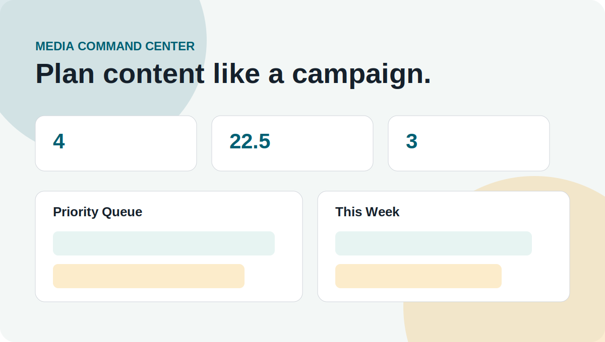

<div align="center">

# Media Command Center


A tactical planning board for creators, campaigns, and content teams.

</div>

Complexity: **Level 2**

Media Command Center prioritizes content ideas by business value, effort, channel fit, and campaign timing.



## Demo

Open `public/index.html` to view the campaign dashboard.

## Live Demo

`https://abdulazizbalu.github.io/media-command-center/`

## Case Study

**Problem:** creators collect ideas everywhere, then publish whatever feels easiest.

**Solution:** score every idea by impact, confidence, effort, and channel fit, then turn the best ideas into a weekly plan.

**What it shows:** digital media strategy, prioritization logic, and dashboard UI thinking.

## Highlights

- Ranks content ideas with impact, confidence, effort, and channel fit
- Builds a weekly publishing plan
- Designed like a creator operations cockpit
- Business logic is covered by tests

## Why It Fits My Profile

- Digital Media Strategist: campaign planning and content prioritization
- AI Specialist: can become an AI-assisted briefing tool
- Full-Stack Developer: business logic is separated from UI

## Test

```bash
npm test
```
